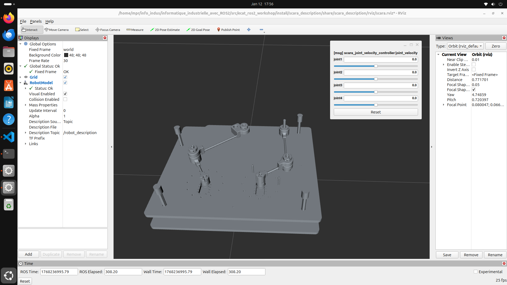

==============================================================
Implémentation du modèle RViz du pantographe sur votre machine
==============================================================

-------------
Préliminaires
-------------
Avant de commencer, il faut s'assurer d'avoir le bon setup ROS2. Il s'agit de la même configuration que celle utilisée pour le projet du robot Scara (détaillée dans la partie :ref:`Tutoriel ROS2 épicé/Rappels : Setup ROS2 <ros2-setup>`) mais nous allons la résumer ici car quelques commandes ont légèrement été modifiées.

Un projet ROS2 se compile et s'exécute dans ce que l'on appelle un ``workspace`` souvent abrévié en ``ws`` dans lequel se trouve un répertoire ``src`` qui contient les packages ROS2 que vous allez créer ou que vous allez utiliser. Dans le répertoire de votre choix, ici ``info_indus``, créez le répertoire ``ros2_ws``.

.. code-block:: bash

   cd ~/info_indus/
.. code-block:: bash

   mkdir ros2_ws

Nous pouvons maintenant y ajouter les fichiers sources du package ROS2 du projet.

.. code-block:: bash

   cd ~/info_indus/ros2_ws
.. code-block:: bash

   git clone --branch pantographe_rviz --single-branch https://github.com/Guig-gs/informatique_industrielle_avec_ROS2.git

La commande ``--branch`` permet de se positionnner dans la branche ``pantographe_rviz`` et ``--single-branch`` permet de clôner uniquement cette branche du dépôt GitHub.

Afin d'accélerer les processus de compilation et d'exécution, nous allons utiliser des macros bash qui facilitent la tâche quand on utilise la suite d'outils ROS2 centrée sur ``colcon``.

Ouvrez votre fichier ``~/.bashrc`` avec vscode:

.. code-block:: bash

   code ~/.bashrc

Ajoutez à la fin du fichier les lignes suivantes, si cela n'a pas déjà été fait :

.. literalinclude:: resources/code/_.bashrc
   :language: bash
   :caption: Addons au fichier .bashrc
   :linenos:

Enregistrez le fichier et fermez vscode.

Rechargez votre fichier ``~/.bashrc`` pour prendre en compte les modifications:

.. code-block:: bash

   source ~/.bashrc

Vous pouvez maintenant utiliser les macros bash que vous venez de définir.

----------------------
Utilisation du package
----------------------

Nous allons maintenant compiler le package ROS2 que nous venons de cloner à l'aide des macros bash que nous venons de définir.

.. code-block:: bash

   cd ~/info_indus/ros2_ws
.. code-block:: bash

   sudo apt-get update
.. code-block:: bash

   ros2_jazzy
.. code-block:: bash

   ros2_build

Si tout s'est bien passé, vous devriez voir un message de succès à la fin de la compilation.

.. code-block:: bash

   #All required rosdeps installed successfully
   Starting >>> scara_description
   Starting >>> scara_bringup
   Starting >>> scara_joint_velocity_controller
   Starting >>> scara_nodes
   Finished <<< scara_description [0.88s]                                                               
   Starting >>> scara_hardware
   Finished <<< scara_nodes [0.90s]                                  
   Finished <<< scara_bringup [1.14s]                                  
   Finished <<< scara_hardware [4.50s]                                                     
   Finished <<< scara_joint_velocity_controller [8.28s]                     

   Summary: 5 packages finished [8.52s]

.. note::

   ``ros2_jazzy`` est un alias qui charge l'environnement ROS2 de la distribution jazzy.
   ``ros2_build`` est un alias qui installe les dépendences et compile tout le workspace ROS2 courant.

Finalement, la commande ci-dessous permet de lancer le noeud ROS2 qui ouvre RViz avec le modèle du pantographe.

.. code-block:: bash

   ros2 launch scara_bringup scara.launch.py

   Pantographe modélisé dans RViz

   Le pantographe ne peut pas être assemblée dans RViz, nous avons cassé la liaison centrale. En effet, RViz ne prend pas en charge les systèmes en boucle fermée